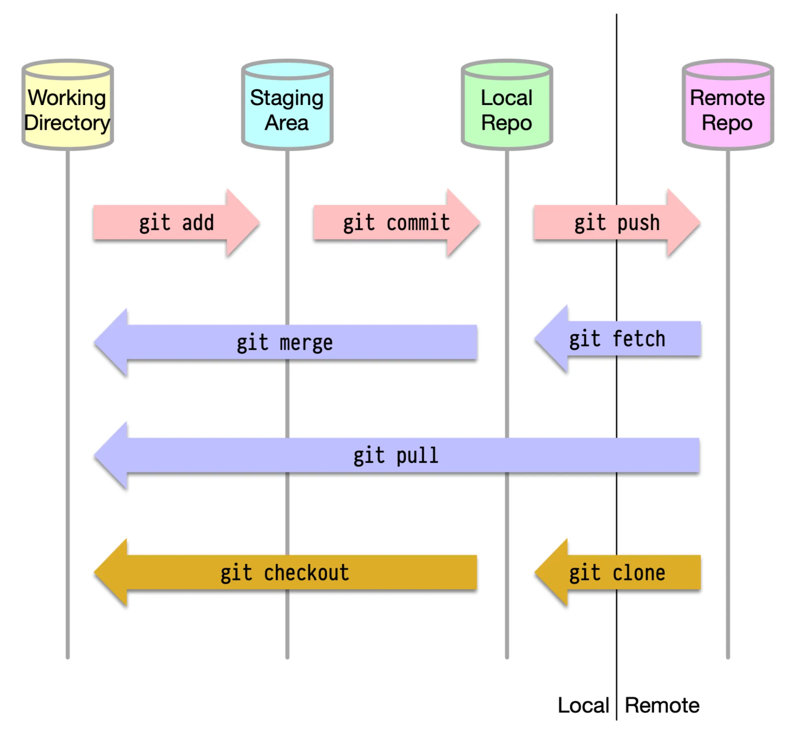

# PHẦN 3: GIT CƠ BẢN

---

# 1. Git Cheatsheet

## 1.1. Getting & Creating Projects

| Command                                                           | Description                                |
| ----------------------------------------------------------------- | ------------------------------------------ |
| `git init`                                                        | Initialize a local Git repository          |
| `git clone ssh://git@github.com/[username]/[repository-name].git` | Create a local copy of a remote repository |

## 1.2. Basic Snapshotting

| Command                            | Description                                                           |
| ---------------------------------- | --------------------------------------------------------------------- |
| `git status`                       | Check status                                                          |
| `git add [file-name.txt]`          | Add a file to the staging area                                        |
| `git add -A`                       | Add all new and changed files to the staging area                     |
| `git commit -m "[commit message]"` | Commit changes                                                        |
| `git rm -r [file-name.txt]`        | Remove a file (or folder)                                             |
| `git remote -v`                    | View the remote repository of the currently working file or directory |

## 1.3. Branching & Merging

| Command                                              | Description                                             |
| ---------------------------------------------------- | ------------------------------------------------------- |
| `git branch`                                         | List branches (the asterisk denotes the current branch) |
| `git branch -a`                                      | List all branches (local and remote)                    |
| `git branch [branch name]`                           | Create a new branch                                     |
| `git branch -d [branch name]`                        | Delete a branch                                         |
| `git push origin --delete [branch name]`             | Delete a remote branch                                  |
| `git checkout -b [branch name]`                      | Create a new branch and switch to it                    |
| `git checkout -b [branch name] origin/[branch name]` | Clone a remote branch and switch to it                  |
| `git branch -m [old branch name] [new branch name]`  | Rename a local branch                                   |
| `git checkout [branch name]`                         | Switch to a branch                                      |
| `git checkout -`                                     | Switch to the branch last checked out                   |
| `git checkout -- [file-name.txt]`                    | Discard changes to a file                               |
| `git merge [branch name]`                            | Merge a branch into the active branch                   |
| `git merge [source branch] [target branch]`          | Merge a branch into a target branch                     |
| `git stash`                                          | Stash changes in a dirty working directory              |
| `git stash clear`                                    | Remove all stashed entries                              |
| `git stash pop`                                      | Apply latest stash to working directory                 |

## 1.4. Sharing & Updating Projects

| Command                                                                           | Description                                                 |
| --------------------------------------------------------------------------------- | ----------------------------------------------------------- |
| `git push origin [branch name]`                                                   | Push a branch to your remote repository                     |
| `git push -u origin [branch name]`                                                | Push changes to remote repository (and remember the branch) |
| `git push`                                                                        | Push changes to remote repository (remembered branch)       |
| `git push origin --delete [branch name]`                                          | Delete a remote branch                                      |
| `git pull`                                                                        | Update local repository to the newest commit                |
| `git pull origin [branch name]`                                                   | Pull changes from remote repository                         |
| `git remote add origin ssh://git@github.com/[username]/[repository-name].git`     | Add a remote repository                                     |
| `git remote set-url origin ssh://git@github.com/[username]/[repository-name].git` | Set a repository's origin branch to SSH                     |

## 1.5. Inspection & Comparison

| Command                                    | Description                    |
| ------------------------------------------ | ------------------------------ |
| `git log`                                  | View changes                   |
| `git log --summary`                        | View changes (detailed)        |
| `git log --oneline`                        | View changes (briefly)         |
| `git diff [source branch] [target branch]` | Preview changes before merging |

---

# 2. Git Workflow

## 2.1. Repository

**Repositories**, thường được gọi là ‘_repos_’, là nơi lưu trữ toàn bộ lịch sử và kiểm soát phiên bản của một dự án.

**Lưu trữ:**

- Repositories có thể được lưu trữ cục bộ trên máy tính hoặc trên một máy chủ chia sẻ, chẳng hạn như GitHub.
- Phần lớn repositories thường được lưu trữ trên GitHub, nơi các cộng tác viên chính sẽ tạo bản sao của repository trên máy của họ và cập nhật repository thông qua hệ thống push/pull.

**Kho từ xa (Remote Repository):**

- Bất kỳ repository nào không được lưu trữ cục bộ trên máy tính đều được gọi là ‘_remote repository_’.

## 2.2. Repos vs. Directories

**Repositories** và **directories** có sự khác biệt quan trọng:

- **_Repositories_**:
  - Là một dòng thời gian lưu giữ toàn bộ lịch sử của dự án, bao gồm tất cả các thay đổi được thực hiện.
  - Repositories chứa các bản ghi chi tiết về cách dự án phát triển qua thời gian.
- **_Directories (Working Directories)_**:
  - Là trạng thái hiện tại của dự án tại một thời điểm cụ thể.
  - Bất kỳ thư mục cục bộ nào liên kết và làm việc với một repository đều có thể được xem là một repository. Tuy nhiên, để dễ phân biệt, chúng thường được gọi là ‘_local repositories_’, vì chúng là phiên bản cục bộ của một repository từ xa.

## 2.3. Workflow Diagram

Biểu đồ workflow minh họa cách thức hoạt động cơ bản của quy trình Git.



**Khu vực staging (Staging Area):**

- Đây là nơi tập hợp tất cả các thay đổi đã thực hiện trên dự án mà bạn muốn ghi nhận (commit).
- Staging area giống như một bản nháp, cho phép bạn lựa chọn thay đổi nào sẽ được đưa vào lịch sử của repository.

**Commit:**

- Hành động commit giống như chụp một ảnh chụp nhanh (snapshot) của trạng thái hiện tại của dự án, và lưu lại nó trên một dòng thời gian.
- Mỗi commit là một bước phát triển của dự án, giúp dễ dàng quay lại hoặc kiểm tra lịch sử thay đổi khi cần.

Workflow trong Git thường bao gồm ba bước chính:

1. Làm việc trên Working Directory – Bạn thực hiện các thay đổi trong dự án.
2. Thêm vào Staging Area – Bạn chọn các thay đổi để ghi nhận.
3. Commit – Lưu trạng thái hiện tại vào lịch sử repository.

Workflow này giúp bạn quản lý và theo dõi tiến trình làm việc của dự án một cách rõ ràng và có tổ chức.

---

# 3. Tạo một Repository mới

Dưới đây là các bước chi tiết để tạo một repository mới sử dụng Git:

## 3.1. Khởi tạo Local Repository

**Local Repository** là nơi lưu trữ dự án trên máy tính của bạn. Làm theo các bước sau:

1. **Tạo một thư mục cho dự án:**
   - Mở Git Bash (hoặc terminal / command prompt).
   - Tạo một thư mục mới và điều hướng đến thư mục đó:
     ```bash
     mrdir prj_name
     cd prj_name
     ```
2. **Khởi tạo Git trong thư mục:**
   - Chạy lệnh sau để biến thư mục hiện tại thành một repository Git:
     ```bash
     git init
     ```
   - Git sẽ tạo một thư mục ẩn `.git`, nơi lưu trữ dữ liệu và lịch sử của repository.

## 3.2. Thêm Tệp vào Repository

1. Tạo hoặc sao chép tệp vào thư mục làm việc:

   - Bạn có thể tạo tệp bằng cách sử dụng trình soạn thảo hoặc sao chép các tệp hiện có vào thư mục.

2. Thêm tệp vào Staging Area:

   - Sử dụng lệnh sau để thêm một tệp cụ thể:
     ```bash
     git add file_name
     ```
   - Hoặc thêm tất cả các tệp:
     ```bash
     git add -A
     ```

3. Lưu trạng thái đầu tiên của dự án (Commit):
   - Ghi lại trang thái đầu tiên của dự án:
     ```bash
     git commit -m "Initial commit"
     ```

## 3.3. Tạo Remote Repository

**Remote Repository** là nơi bạn lưu trữ dự án trực tuyến, giúp bạn dễ dàng chia sẻ và làm việc nhóm.

1. **Đăng nhập vào GitHub (hoặc nền tảng khác):**

- Truy cập [GitHub](https://github.com/) và đăng nhập tài khoản.

2. **Tạo repository mới trên GitHub:**

- Nhấp vào nút `New repository`.
- Điền thông tin:
  - `Repository name`: Tên repository (ví dụ: `ten-du-an`).
  - `Description`: Mô tả ngắn gọn về dự án (tuỳ chọn).
  - `Visibility`: Chọn Public (công khai) hoặc Private (riêng tư).
- Nhấn `Create repository`.

## 3.4. Kết nối Local Reposiroty và Remote Repository

1. Kết nối Local repository và Remote repository
   - Sao chép URL Remote repository (dạng SSH hoặc HTTPS)
   - Thêm URL này làm remote origin:
     ```bash
     git remote add origin <URL-repository>
     ```
2. Đẩy nội dung lên Remote repository
   - Đẩy commit đầu tiên lên GitHub:
     ```bash
     git push -u origin main
     ```
   - Nếu nhánh chính không phải `main`, thay đổi `main` thành tên nhánh của bạn.

## 3.5. Xác minh kết nối thành công

1. Kiểm tra Remote repository
   - Xác minh liên kết với GitHub:
     ```bash
     git remote -v
     ```
2. Kiểm tra nội dung trên GitHub:
   - Truy cập repository trên GitHub và kiểm tra các tệp được đẩy lên.
